# Abstract

#### This paper investigates the performance impact of several basic cache configuration parameters, such as the L1, L2, and TLB cache size, associativity, and block size using the SimpleScalar ”sim-outorder” model and the SPEC 2000 benchmark suite. The results generated illustrate the relationship between Miss Rate and modifications in cache size, associativity, and block size. The results also reveal the impact of the multilevel cache design as well as the efficacy of the TLB cache in enhancing data locality.

_Please see the ACA_project.pdf file for more information_

# Experimental Results
The cache parameters corresponding to the Instruction cache and data cache in the configuration files were varied to form 10 different setups. Then, a shell script was used to run each configuration on each SPEC2000 benchmarks. First, 100 million instructions were skipped to ensure proper warming up of the caches. Then, each benchmark was run for 100 million instructions to acquire the results.

# Images

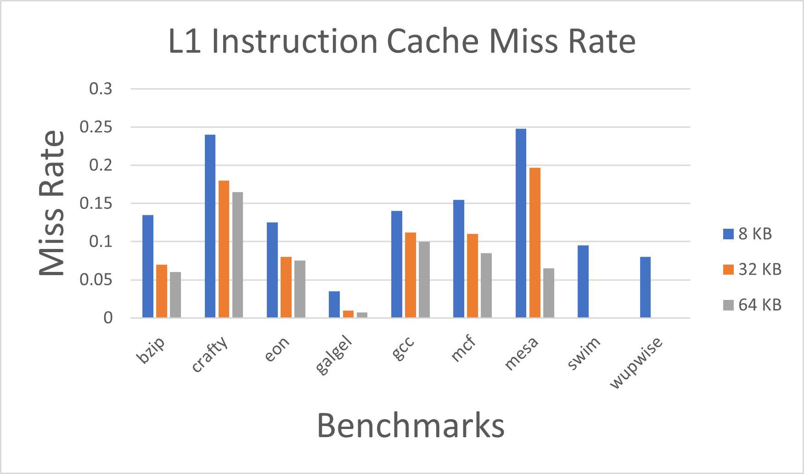
Fig. 1. Instruction Cache L1 Miss Rate by changing the cache size with constant block size of 32B and 1-way associativity.

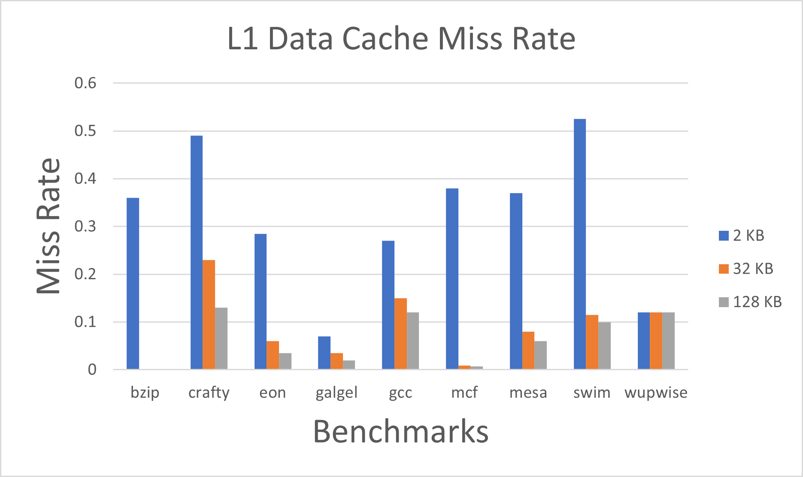
Fig. 2. Data Cache L1 Miss Rate by changing the cache size with constant block size of 32B and 1-way associativity.

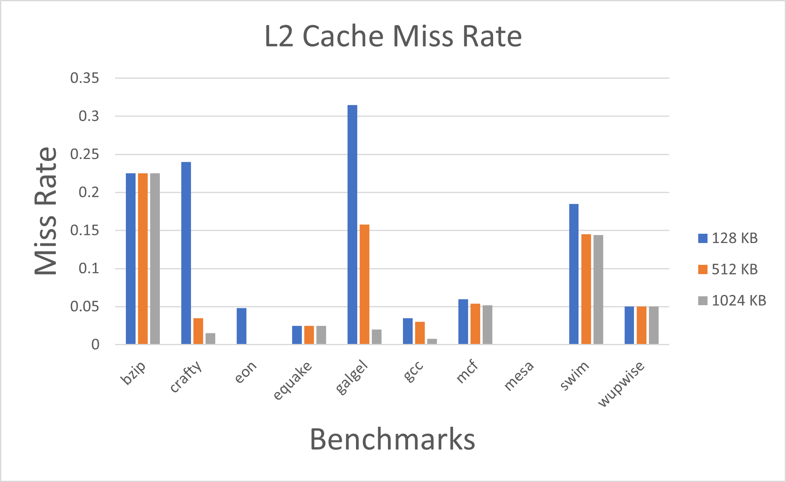
Fig. 3. Miss Rate for L2 cache by changing the cache size with constant block size of 64B and 4-way associativity

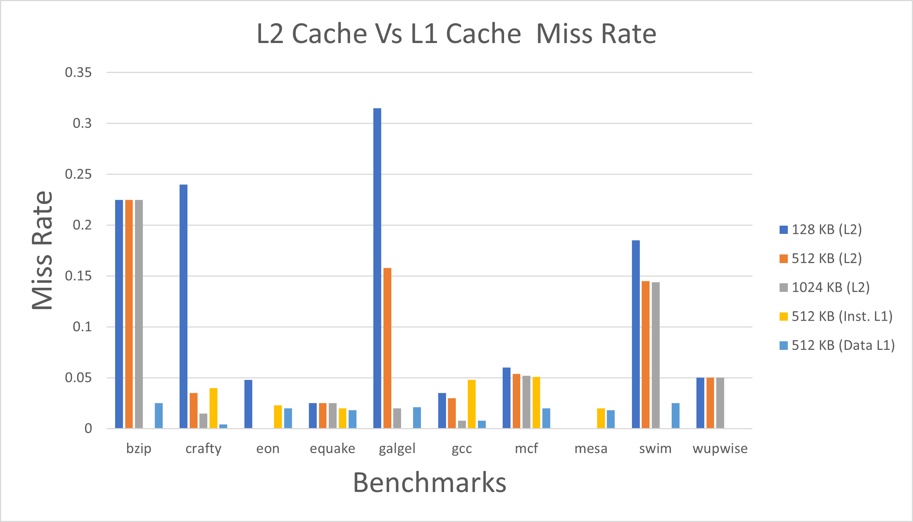
Fig. 4. L2 Cache Vs L1 Cache Miss Rate by changing the L2 cache size and keeping block size of 64B and 4-way associativity (L1 cache size is 512 KB).

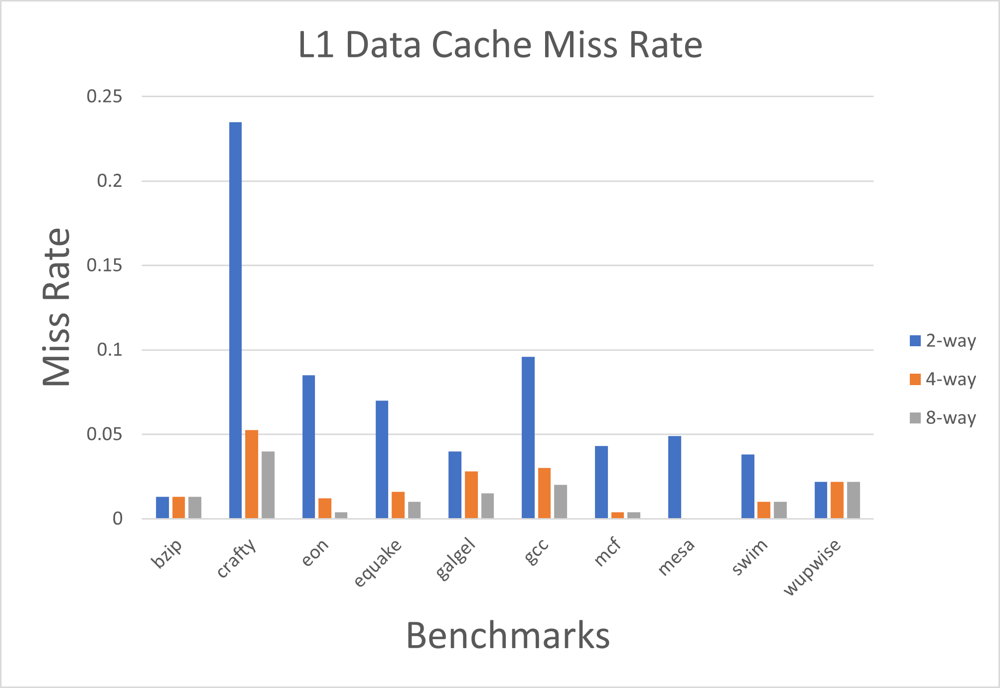
Fig. 5. Miss Rate for L1 data cache by changing the associativity with constant cache size of 32KB and block size of 32B.

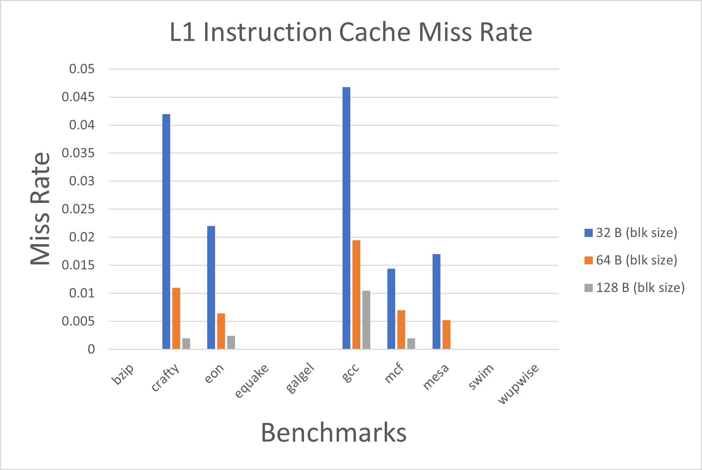
Fig. 6. Miss Rate for L1 Instruction Cache with change in block size setting constant cache size of 512KB and associativity as 1-way.

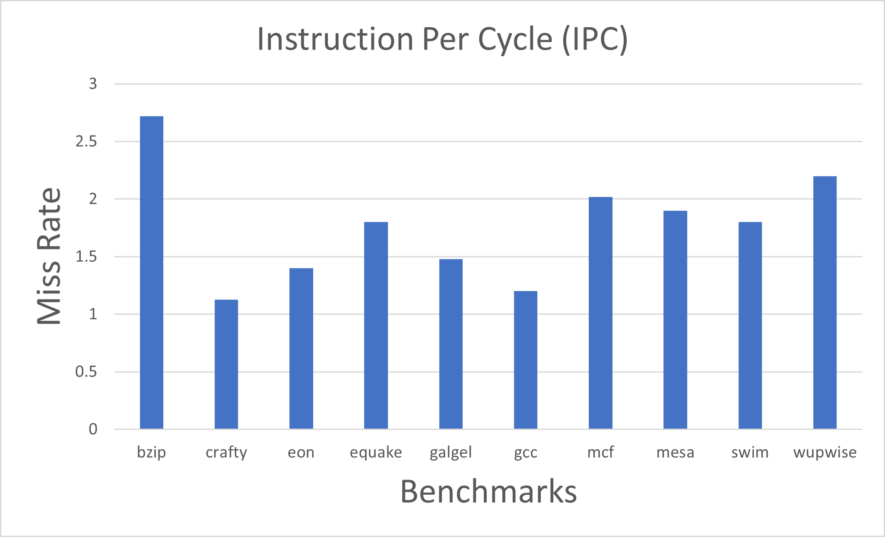
Fig. 7. IPC value for every Benchmarks

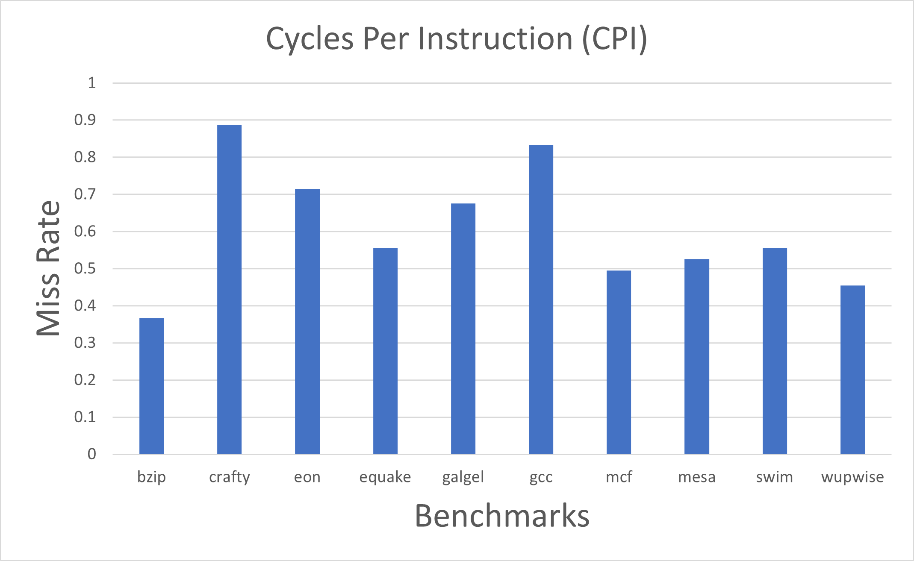
Fig. 8. CPI value for every Benchmarks

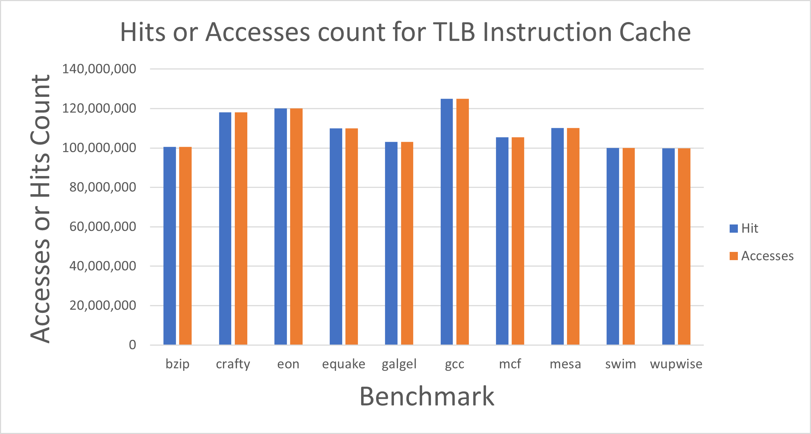
Fig. 9. Hit Count and Accesses for TLB Instruction Cache

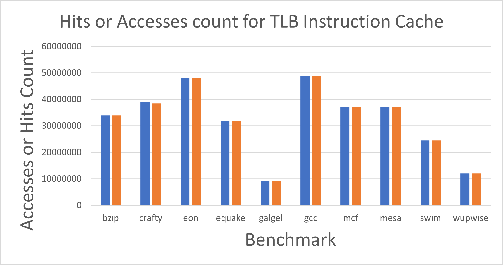
Fig. 10. Hit Count and Accesses for TLB Data Cache

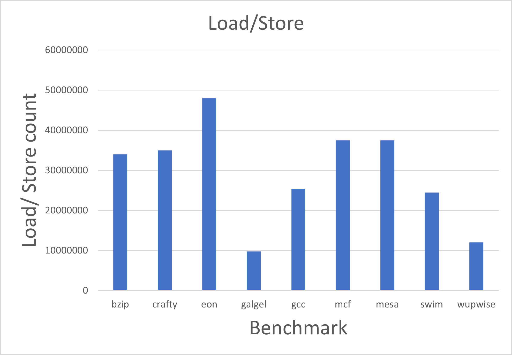
Fig. 11. Load/ Store Count in benchmarks.